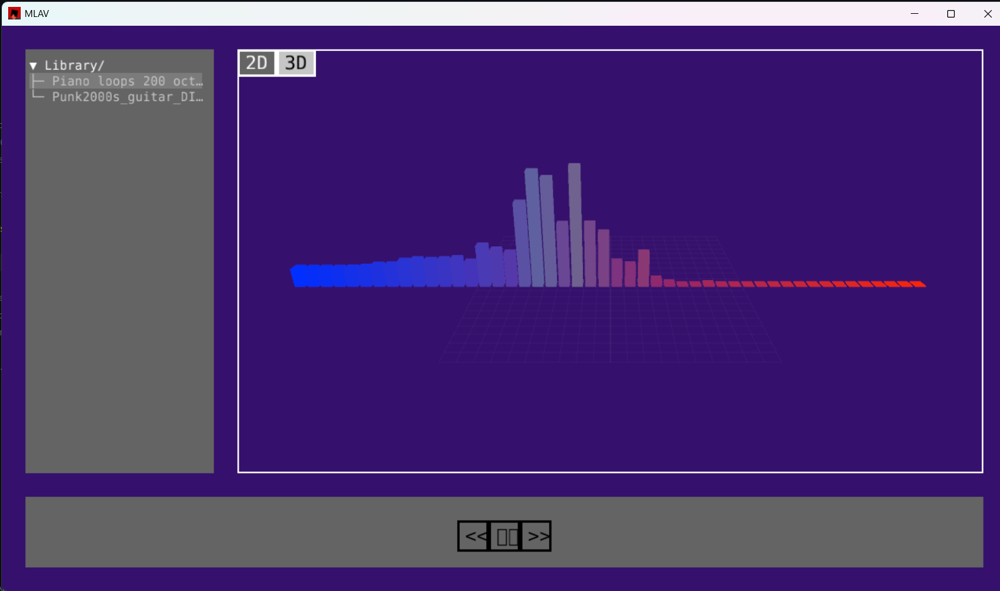

# Ulisses Pineda Guzman's Programming Portfolio 2025-2026
#### (Some people know me as Rex. Call me what you like.)
+ Projected Graduation in 2027
+ Created a [Minecraft Mod](https://github.com/Rexboy909/Facland) in 2022
+ Was a part of a [Voxel-Based Game](https://github.com/SaltyNickel702/BlockScape)
+ Proficient in Adobe Photoshop
+ Proficient in Adobe Illustrator
+ Light experience in Blender

## Music & Lyric Audio Visualizer | 3/30/26

MLAV is meant to be music player that dynamically displays the lyrics of the song playing and features visualizers for the songs.
The program will support uncompressed audio, like .wav and .flac files, as well as other formats, like mp3, aac, and ogg.
The application will render different audio visualizers for the current song and will try to incorporate lyrics into the visualizer.

[Source](assets/Images/assignment_files)

[Repo](https://github.com/Rexboy909/MLAV)
